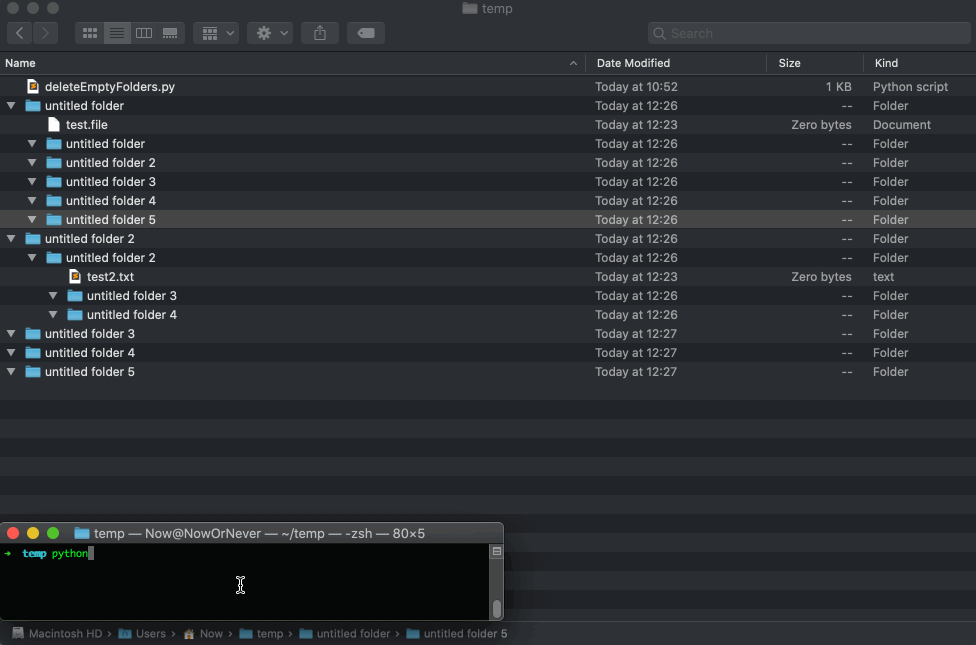

# Fun python tools

## 1. change background tool

### How to use:
1. download the [python file](./changeBackGround/changeBackGround.py) at  `your_images_folder`, `your_images_folder` can contain other `image_folder`
2. open terminal, cd `your_images_folder`
3. run `python3 changeBackGround.py` in your terminal

[Code](./changeBackGround/changeBackGround.py)
### Custom setting:
1. to change target folders, change line `target_dirs = []`
2. to set interval , change line `interval_in_seconds = 1`
3. to set total times you wnat to change the background, change line `total_change_times`
4. for particular image formats you want to use, change line `support_image_formats = ['jpg', 'jpeg', 'png']`

## 2. delete empty folders tool

### How to use:
1. download the [python file](./deleteEmptyFolders/deleteEmptyFolders.py) at  `target_folder`, `your_images_folder` can contain other `target_folder`
2. open terminal, cd `target_folder`
3. run `python3 deleteEmptyFolders.py` in your terminal

### Custom setting:
1. to change target folders, change line `target_dirs = []`